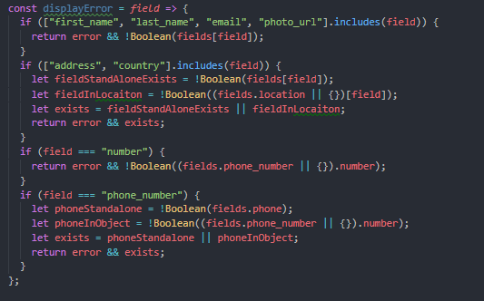

There is a lot of benefits to gain when using React Hooks. These benefits are mostly obvious after working with the class component syntax for a while. 

### The Good

One of such benefits observed when transitioning to hooks is that, when using [ESLint](https://eslint.org/), text editors like Visual Studio Code visually highlight/dim functions that aren't in use. In a class component, such functions are attached as methods and even when they aren't in use, you as the developer do not know and so they remain there as `zombies`. 

**Without Hooks**


**With Hooks**



*NB: It is possible to get VSCode to highlight class methods that aren't in use either through using Typescript or adding the following code at the top of the file `//@ts-check`*


>**There are other benefits but that would be the subject for another post.**


### The Ugly that eventually turns to Good

Transitioning to hooks from class components is not all roses. There are things you could get away with when using class components but result in errors/buggy code with hooks.

Take the following snippet for example

```js
class Checkout extends React.Component{
    ...
    handleDurationChange = duration => {
        if (typeof duration === "string") {
            this.setState({ duration }, () => {
                if (this.state.display === "payment") {
                    this.generateNewPayment();
                }
            });
        }
    }
    generateNewPayment = (successCallback = () => {}) => {
        let { coupon = "" } = this.state;
        this.props
        .updateCoupon({ ...this.state, plan: this.state.currentPlan })
        .then(data => {
            successCallback(true, data.discount === 0);
            this.setState({
                discount: data.discount,
                isInvalidCoupon: coupon ? data.discount === 0 : false,
                isCouponApplied: data.discount > 0
            });
        });
    };
  ...
}
```

This component was extracted from a  project I was recently working on. the `handleDurationChange` method capitalizes on the fact that `this.setState` takes [a second parameter which is a callback function that gets called after the update has been applied](https://reactjs.org/docs/react-component.html#setstate). You as the developer can be sure that before `this.generateNewPayment` is called, `this.state.duration` has been updated.

When the `generateNewPayment` method is eventually called, we have the latest version of the state been passed to the `updateCoupon` function passed as a props. 

If we were to write the hook equivalent based on the above example, it looks like this

```js

const Checkout = ({plans,updateCoupon})=>{
    let [currency, setCurrency] = useState(...)
    let [duration, setDuration] = useState(...)
    ...
    const handleDurationChange = value => {
        if (typeof value === "string") {
            setDuration(value);
            if (display === "payment") {
                generateNewPayment({ duration: value });
            }
        }
    };
    const generateNewPayment = ( existingData = {}, successCallback = () => {} ) => {
        updateCoupon({
            currency,
            duration,
            coupon,
            plan: currentPlan,
            ...existingData
        }).then(data => {
            successCallback(true, data.discount === 0);
            setDiscount(data.discount);
            setIsInvalidCoupon(coupon ? data.discount === 0 : false);
            setIsCouponApplied(data.discount > 0);
        });
    };
}
```
In the hooks version, there isn't any second callback we can call to guarantee an update on the `setDuration` function. Because we can't guarantee that React would have updated the `duration` state before `generateNewPayment` gets called, the need to update the implementation of the `generateNewPayment` function becomes obvious. 

The updated `duration` value is passed as an object to the `generateNewPayment` function which in turn, overwrites the old `duration` value been used, with the help of the spread operator.

### Ha Ha Moment

Taking a closer look at the hooks implementation, it exposes a problem with the class component implementation. The class component implementation was depending on React's updating the `duration` state before calling `this.generateNewPayment`. After thinking about this for a while, It didn't seem right for that to be the behavior. I shouldn't have to wait for an update from React before I can proceed. 

I could have written the hooks equivalent as the class solution but it wasn't obvious because there were more that one way of achieving the result and it appeared to work. But with hooks, there was only one obvious way to achieve the expected result which prove to be the better solution to the problem.

> Python Zen 13: There should be one—and preferably only one—obvious way to do it.

